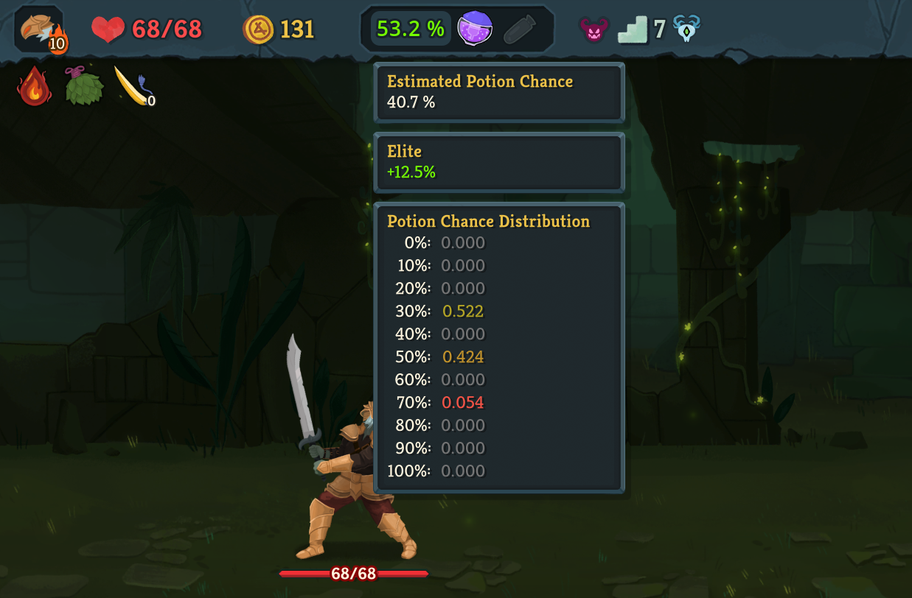

**DISCLAIMER**: As of patch v0.106.0, the non-determinism in potion chance has been fixed, so the estimator functionality is deprecated. See the main branch for the up-to-date version.

# Potion Chance

This is a potion chance estimator and display mod for Slay the Spire 2.

## How does potion chance work?

Players coming from Slay the Spire 1 may be wondering why an estimator for potion chance is necessary at all since it was always easily possible to track the potion chance in that game.

The basics in Slay the Spire 2 are the same from the previous: Your potion chance starts at 40% and at the end of every fight, potion chance decreases/increases by 10% depending on whether a potion drops/does not drop.

However, there are three big changes to the potion chance:
1. The potion chance does not reset to 40% at the start of a new act.
2. Elites have a bonus 12.5% chance to drop a potion.
3. The above elite bonus does not affect the *change* in potion chance. This means that there is a 12.5% chance for an elite to drop a potion and for the potion chance to increase.

The non-determinism introduced by the third point above means that once an elite drops a potion, the player can only estimate (but never exactly determine) the potion chance from then on.

## Estimators

This mod includes two different estimators: 
- `HmmEstimator`: A [hidden Markov model](https://en.wikipedia.org/wiki/Hidden_Markov_model). This is the default and recommended estimator as it utilizes all information available to the player.
- `Sts1Estimator`: An easily mentally computed model. This model ignores the non-determinism from the elite bonus and always adjusts its estimated potion chance downward when a potion drops. This estimator performs only ~5-8% worse than the `HmmEstimator` (see [EstimatorComparison](https://github.com/senwa105/PotionChance/tree/v1/EstimatorComparison) for details), so those who do not want to rely on mods can copy this estimator for almost all of the benefits of the `HmmEstimator`.
