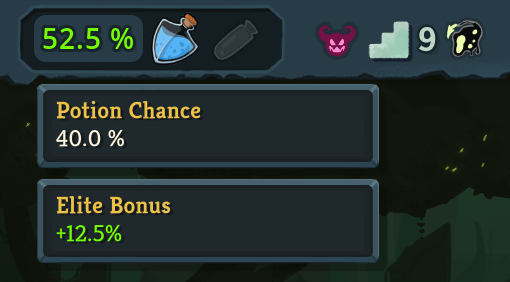

# Potion Chance

This is a potion chance display mod for Slay the Spire 2.

This mod included an estimator (and was therefore signficantly more interesting) before the non-determinism bug was fixed in v0.106.0. See the [v1 branch](https://github.com/senwa105/PotionChance/tree/v1).

## How does potion chance work?

The basics in Slay the Spire 2 are the same from StS1: Your potion chance starts at 40% and at the end of every fight, potion chance decreases/increases by 10% depending on whether a potion drops/does not drop.

However, there are two changes to the mechanic from the first game:
1. The potion chance does not reset to 40% at the start of a new act.
2. Elites have a bonus 12.5% chance to drop a potion.
